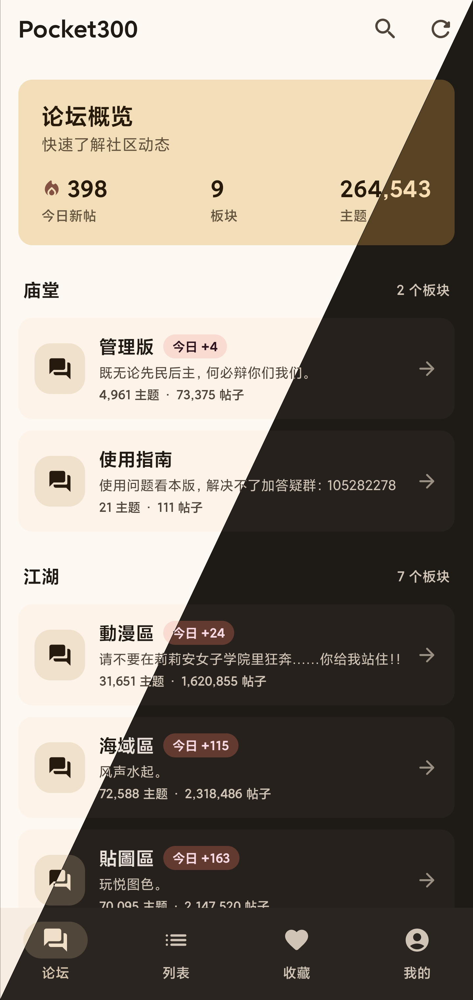

# Pocket300

[](https://github.com/TnZzZHlp/Pocket300/actions/workflows/ci.yml)
[](https://github.com/TnZzZHlp/Pocket300/releases)

Pocket300 是一个面向[百合会（Yamibo）](https://bbs.yamibo.com/)的第三方 Android 客户端，使用 Kotlin 与 Jetpack Compose 构建，提供更适合移动端的论坛浏览和阅读体验。

> 本项目并非百合会官方应用。使用本应用访问论坛时，请遵守百合会的服务条款和社区规则。

## 应用预览



## 功能

- 浏览论坛概览、板块、置顶主题和主题详情
- 按全文、标题或用户 ID 搜索主题，并支持分页加载
- 创建自定义列表，汇总多组搜索条件；应用在前台时会按可设间隔（默认 24 小时）定时更新，并可按阅读状态和发布时间筛选
- 使用百合会账号登录，查看个人资料、收藏主题和评分详情
- 保留登录 Cookie，应用重启后无需重复登录
- 自动记录阅读历史，并可从上次阅读楼层继续
- 提供仅看楼主、文字阅读器和图片阅读器
- 调整阅读字号、行距和背景色
- 支持系统动态配色、米黄、紫罗兰、海洋蓝和青翠绿主题

## 获取应用

- [正式版与预发布版](https://github.com/TnZzZHlp/Pocket300/releases)
- [最新开发版](https://github.com/TnZzZHlp/Pocket300/releases/tag/continuous)：由 `main` 分支自动构建，可能包含尚未充分验证的改动

Pocket300 支持 Android 8.0（API 26）及以上版本。安装从 GitHub 下载的 APK 时，系统可能要求允许浏览器或文件管理器安装未知来源应用。

## 开发环境

- JDK 17
- Android Studio 或 Android SDK 命令行工具
- Android SDK Platform 36.1
- Windows、macOS 或 Linux

克隆仓库后，在 Android Studio 中打开项目根目录。若 Android Studio 没有自动生成 `local.properties`，请在其中指定 SDK 路径：

```properties
sdk.dir=C\:\\Users\\your-name\\AppData\\Local\\Android\\Sdk
```

然后在 Windows PowerShell 中构建调试 APK：

```powershell
.\gradlew.bat assembleDebug
```

macOS 或 Linux 请使用：

```bash
./gradlew assembleDebug
```

构建产物位于 `app/build/outputs/apk/debug/app-debug.apk`。也可以连接设备或启动模拟器后运行：

```powershell
.\gradlew.bat installDebug
```

## 测试与检查

提交代码前建议运行完整验证：

```powershell
.\gradlew.bat testDebugUnitTest lintDebug assembleDebug
```

常用的单项命令如下：

```powershell
.\gradlew.bat testDebugUnitTest  # 本地 JUnit 测试
.\gradlew.bat lintDebug          # Android Lint
.\gradlew.bat assembleDebug      # 调试构建
```

CI 会对涉及应用代码或构建配置的 `main` 分支拉取请求执行相同的测试、Lint 和构建任务；纯文档改动会跳过这些任务。

## 构建签名版

Windows 下可以使用仓库根目录的 `build-release.ps1` 构建并签名 APK。默认要求：

- 密钥库位于 `%USERPROFILE%\pocket300-release.jks`
- 密钥别名为 `pocket300`
- 已通过 `ANDROID_SDK_ROOT`、`ANDROID_HOME` 或 `local.properties` 配置 Android SDK

运行：

```powershell
.\build-release.ps1
```

脚本会提示输入密钥库密码，并将签名后的 APK 输出到：

```text
app\build\outputs\apk\release\app-release-signed.apk
```

如需使用其他密钥库或别名：

```powershell
.\build-release.ps1 -KeystorePath D:\keys\release.jks -KeyAlias my-alias
```

推送符合 `v*` 格式的标签（例如 `v1.2.3` 或 `v1.2.3-beta.1`）后，GitHub Actions 会构建签名 APK 并发布到 GitHub Releases。

## 项目结构

```text
app/src/main/java/com/yamibo/pocket300/
├── api/        # 百合会 API、网络传输与响应解析
├── data/       # 阅读历史和自定义列表的本地 SQLite 存储
├── ui/         # Compose 页面、组件、主题和 ViewModel
└── MainActivity.kt

app/src/test/        # 本地 JVM 测试
app/src/androidTest/ # 设备与模拟器测试
```

主要技术包括 Jetpack Compose、Material 3、Navigation Compose、Kotlin Coroutines、OkHttp、Coil 和 SQLite。依赖版本统一维护在 `gradle/libs.versions.toml`。

## 数据说明

应用会直接连接百合会服务器。登录状态通过 Android 的持久化 Cookie 存储保存；阅读历史、自定义列表和界面偏好保存在设备本地。卸载应用或清除应用数据会删除这些本地数据。

## 参与开发

请从最新的 `origin/main` 创建描述清晰的功能或修复分支，不要直接向 `main` 提交功能改动。提交信息使用带作用域的 Conventional Commits 格式，例如：

```text
feat(ui): add thread filter
fix(api): handle empty forum response
```

新功能和问题修复应包含针对性的回归测试。提交拉取请求前，请确保本地完整验证通过。

## 许可证

本项目采用 [MIT License](LICENSE) 开源。
